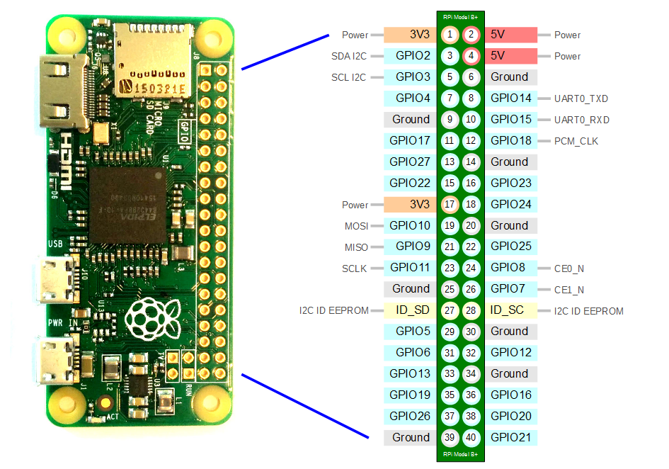

# Raspberry PI
## Short Introduction
- [What is a Raspberry Pi?](https://www.raspberrypi.org/help/what-%20is-a-raspberry-pi/)
- [Raspberry Pi Boards](https://www.raspberrypi.org/products/)
- [Raspberry Pi Zero](https://www.raspberrypi.org/products/raspberry-pi-zero/)

## Interfacing hardware with the Raspberry
Pinout Orientation RaspberyPi Zero W



Connect devices with [wires and boards](https://therestartproject.org/wp-content/uploads/2018/08/Raspberry-Pi-thermostat-900x600.jpg)

## What is Grove
Grove is a modular, standardized connector prototyping system.

Grove connectors look like these:


Many different Grove-modules are available:
* [Sensors](http://wiki.seeedstudio.com/Sensor/)
* [Actuators](http://wiki.seeedstudio.com/Actuator/)
* [Displays](http://wiki.seeedstudio.com/Display/)
* [Communication](http://wiki.seeedstudio.com/Communication/)
* [Others](http://wiki.seeedstudio.com/Others/)


## Raspberry Pi HAT
HAT stands for “Hardware attached on top”. It is a new hardware specification for add-one modules for the Raspberry Pi.

Auto-configuration is a most interesting feature of HATs. With a controller on the board, the add-on board identifies itself. It tells the Raspberry Pi, which IO pins it is using, how they need to be configured and what drivers have to be loaded. 


## Grove Base Hat for Raspberry Pi Zero
In our examples we will use a [Hat for Raspberry Pi Zero:](http://wiki.seeedstudio.com/Grove_Base_Hat_for_Raspberry_Pi_Zero/) 


## Grove.py library
[Grove.py](https://pypi.org/project/grove.py) is python library for [Seeedstudio](http://wiki.seeedstudio.com) Grove devices.

* The grove.py project on GitHub: https://github.com/seeed-studio/grove.py
* [Command Line Interface](https://github.com/Seeed-Studio/grove.py/tree/master/doc) with a list of grove-devices
* API Documentation: https://seeed-studio.github.io/grove.py/

## Hight level architecture

Grove.py depends on different hardware interface/libraries:


### HW-libraries

* [MRAA](https://github.com/intel-iot-devkit/mraa) is a low-level library, developed by Intel, for accessing the I/O functions (GPIO, I2C, SPI, PWM, UART) on a variety of boards such as Intel's Galileo and Edison boards, MinnowBoard Max, Raspberry Pi, and more. It is written in C/C++ and provides Python and Javascript bindings. libmraa supports the UP board since (v0.9.5) and is included with ubilinux.

* [UPM](https://github.com/intel-iot-devkit/upm) (Useful Packages & Modules) is a high-level library that makes use of mraa, and provides packages/modules to manage a variety of sensors and actuators. v0.5.1 is also included with ubilinux.

* [SMBUS ](https://github.com/intel-iot-devkit/upm) (System Management Bus) is a subset from the I2C protocol. [smbus2](https://pypi.org/project/smbus2/) is a Python implementation of the python-smbus package.

### HW-interfaces
* [GPIO](https://www.raspberrypi.org/documentation/usage/gpio/) General purpose input/output
* [I2C](https://i2c.info) is a bus, serial protocol and interface;
* [PWM](https://en.wikipedia.org/wiki/Pulse-width_modulation) is Pulse Width Modulation Interface

## Install Raspbian OS
1. Download the Raspbian-[Image](https://downloads.raspberrypi.org/raspbian_full_latest) "With Desktop and recommended software based on Debian Buster".
<br/>(Other images can be found [here](https://www.raspberrypi.org/downloads/raspbian/))

2. Get the image on the SD Card using a formating tool like [Etcher](https://www.balena.io/etcher/)

3. Copy two config files to SD  Card, to the root folder:
* [ssh](config/ssh) (empty file)
* [wpa_supplicant.conf](config/wpa_supplicant.conf)

4. Edit *wpa_supplicant.conf* to specify wifi-network and password

5. Put the SD Card into Raspberry Pi

6. Power on Raspberry Pi

Here is the video instruction [How to Setup Raspberry Pi Zero](https://www.youtube.com/watch?v=3VO4vGlQ1pg&t=178s)

## SSH to Raspberry Pi
First try to ping Raspberry to make sure that it is up and running:
```bash
ping raspberrypi.local
```

Than try ssh:
```bash
ssh pi@raspberrypi.local
```
The default password is *raspberry*


## Set up remote Desktop (optional)
```bash
sudo apt-get install tightvncserver
sudo apt-get install xrdp
```

## Install packages

Updated installed packages:
```bash
sudo apt-get update

```
Install [gpiozero](https://gpiozero.readthedocs.io/en/stable/) library (if not installed yet)

```bash
sudo apt install python3-gpiozero
```

Install/update all dependencies and latest [grove.py](https://pypi.org/project/grove.py/):

```bash
curl -sL https://github.com/Seeed-Studio/grove.py/raw/master/install.sh | sudo bash -s -
```
It make take some time (~15-20 min) to install/update all packages. At the end, when everything is successfully installed the follwing message should be printed:
```bash
Successfully installed grove.py-0.6
#######################################################
  Lastest Grove.py from github install complete   !!!!!
#######################################################
```

You may have error(s) during the installation process when you use not a full rasbian image. It happens because some packages are not preinstalled on the light version. Than you need to install missed packages manually. For example, to install pip run the following command:

```bash
sudo apt-get install python3-pip
```
Than install grove.py

```bash
sudo pip3 install grove.py
```

Copy manually MRAA & UPM
```bash
cd /usr/local/lib/python3.7/dist-packages
pi@raspberrypi:/usr/local/lib/python3.7/dist-packages

sudo cp -r /usr/lib/python3.5/dist-packages/upm .
sudo cp /usr/lib/python3.5/dist-packages/mraa.py .
sudo cp /usr/lib/python3.5/dist-packages/_mraa.so .
```

## Simple (hello world!) Led-project 
As an example let's create a simple project with [Led](https://www.seeedstudio.com/Grove-Multi-Color-Flash-LED-5m-p-1141.html).
* Create a python script ```led.py```:
```
import time
from grove.grove_led import GroveLed

# connect to pin 5(slot D5)
PIN = 5
led = GroveLed(PIN)
while True:
    led.on()
    time.sleep(1)
    led.off()
    time.sleep(1)
```
* Connect Led to the slot D5;
* Run the following command:
```bash
python3.7 led.py
```
## Pushbullet

1. [Setup](https://iotdesignpro.com/projects/home-security-system-using-raspberry-pi-and-pir-sensor-with-push-notification-alert) Pushbullet account

2. Installing [Pushbullet Libraries](https://pypi.org/project/pushbullet.py/0.9.1/) on Raspberry Pi
```bash
sudo apt-get update
sudo apt-get upgrade
sudo pip install pushbullet.py
```
3. Check out the [example](examples/push_examples.py)


## Assignements
### Workshop 1
* Install Raspbian OS;
* Hello World app - one [led](https://www.seeedstudio.com/Grove-Multi-Color-Flash-LED-5m-p-1141.html) on / off / disco
* [Motion](https://www.seeedstudio.com/Grove-mini-PIR-motion-sensor-p-2930.html) or [light](https://www.seeedstudio.com/Grove-Light-Sensor-v1-2.html) sensor -> led on / off;
* [Motion](https://www.seeedstudio.com/Grove-mini-PIR-motion-sensor-p-2930.html) sensor and [display](https://www.seeedstudio.com/Grove-OLED-Display-1-12-V2.html) -> show motion detected / lights off

### Workshop 2
Motion sensor and RGB LED are connected to Raspberry, when any motion is detected than:
  * RGB LED is on;
  * A notification is pushed to mobile;
  * SMS-message is sent to mobile (the same or another);
  * A [photo](examples/thief.jpg) is pushed to mobile (let's assume that a photo has been taken by a camera connected to Raspbery when a motion has been detected)


## Useful resources
* Raspberry Pi Foundation: https://www.raspberrypi.org
* Seeed IoT hardware: http://wiki.seeedstudio.com/
* Grove.py CLI with a list of supported divices: https://github.com/Seeed-Studio/grove.py/tree/master/doc
* Dexter Industries (GrovePi): https://www.dexterindustries.com/grovepi/
* Pushbullet.py 0.9.1: https://pypi.org/project/pushbullet.py/0.9.1/
* Pushbullet: https://www.pushbullet.com/
